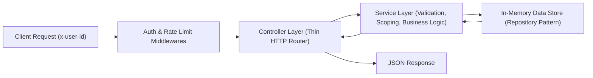

# Notification Inbox APIs

> **Backend Developer Intern Technical Interview Assessment**  
> **Company:** V7 AI Solutions LLP  
> **Author:** Candidate Submission  
> **Tech Stack:** Node.js, TypeScript, Express, Vitest, Supertest, Docker, OpenAPI / Swagger

---

## 1. Project Description & Objectives

This project implements a robust, secure, and performant backend service that manages an in-app notification inbox for users. It simulates real-world product workflows where asynchronous background jobs (e.g., file processing, AI model training, billing cycles) generate notifications that users need to view, paginate, filter, and mark as read.

### Core Objectives
- **Strict Data Isolation:** Guarantee that users can only ever access their own notifications. User A never sees or modifies User B's data.
- **Defense against Insecure Direct Object References (IDOR):** Return `404 Not Found` (rather than `403 Forbidden`) whenever a user attempts to access or modify a notification belonging to another user, preventing attackers from discovering existing notification IDs.
- **Mandatory Pagination & DoS Prevention:** Enforce pagination with hard caps (`limit <= 50`) on list queries to prevent unbounded memory consumption and database abuse.
- **Layered Architecture:** Enforce strict separation of concerns where Controllers remain thin HTTP adaptors and all validation, authorization, and business logic live in the Service layer.
- **Comprehensive Automated Testing:** 100% specification test coverage using Vitest and Supertest across unit and integration suites.

---

## 2. System Architecture

The service follows a strict **Layered Architecture (N-Tier)**:



### Architecture Breakdown
1. **Middlewares (`src/middleware/`):**
   - `auth.middleware.ts`: Authenticates incoming requests by checking the `x-user-id` header. Rejects missing or blank IDs with `401 Unauthorized`.
   - `rate-limiter.middleware.ts`: Token-bucket / sliding window rate limiting to protect public endpoints from brute-force or denial-of-service attempts.
   - `logger.middleware.ts`: Emits structured JSON logs capturing HTTP method, path, status code, latency, and user context.
   - `error.middleware.ts`: Centralized error boundary translating domain exceptions (`AppError`, `NotFoundError`, `ValidationError`, `UnauthorizedError`) into standard JSON payloads.
2. **Controller Layer (`src/controllers/notification.controller.ts`):**
   - Intentionally thin.
   - Responsible solely for HTTP extraction (`req.params`, `req.query`, `req.userId`) and mapping service outcomes to HTTP response status codes.
   - No business logic or database queries reside in controllers.
3. **Service Layer (`src/services/notification.service.ts`):**
   - Heart of the system.
   - Houses the internal `createNotification` function (used by background jobs).
   - Validates all input payloads before processing.
   - Enforces user scoping on every read and write operation.
   - Implements anti-IDOR security semantics.
4. **Data Store Layer (`src/store/in-memory.store.ts`):**
   - In-memory repository abstraction using `Map<string, NotificationRecord>` for $O(1)$ ID lookups and filtered queries.
   - Uses `async` method signatures to enable seamless, zero-refactor swapping with Prisma, TypeORM, or Mongoose for production SQL/NoSQL databases.

---

## 3. Data Model

Compliant with Section 5.6 of the specification:

| Field | Type | Description |
| :--- | :--- | :--- |
| `id` | `string` (UUID v4) | Unique notification identifier |
| `userId` | `string` | Owner user identifier |
| `kind` | `string` | Notification category (e.g., `job_succeeded`, `file_uploaded`) |
| `title` | `string` | Short title (non-empty string) |
| `body` | `string` | Full message content (non-empty string) |
| `resourceType` | `string` (optional) | Associated entity type (e.g., `dataset`, `invoice`) |
| `resourceId` | `string` (optional) | Associated entity ID (e.g., `ds-101`, `inv-8802`) |
| `readAt` | `string \| null` | ISO 8601 timestamp when read; `null` defines an unread notification |
| `createdAt` | `string` | ISO 8601 creation timestamp |

---

## 4. API Endpoints Reference

All endpoints (except health and docs) require the header `x-user-id: <user_id>`.

| Method | Endpoint | Description | Status Codes |
| :--- | :--- | :--- | :--- |
| `GET` | `/notifications` | List user's notifications (paginated, sorted newest first, optional `unread=true`) | `200`, `401` |
| `POST` | `/notifications/:id/read` | Mark single notification as read (anti-IDOR 404 rule) | `200`, `401`, `404` |
| `POST` | `/notifications/read-all` | Mark all notifications belonging to current user as read | `200`, `401` |
| `GET` | `/notifications/:id` | *(Bonus)* Get single notification by ID (404 for other user) | `200`, `401`, `404` |
| `GET` | `/health` | Health check endpoint | `200` |
| `GET` | `/api-docs` | Interactive Swagger / OpenAPI Documentation | `200` |

---

## 5. Security & User Scoping Implementation

### How User Scoping is Enforced
1. **Extraction:** The `auth.middleware.ts` extracts `x-user-id` from the request header and attaches it as `req.userId`.
2. **Pass-through:** The controller passes `req.userId` directly into the service layer methods.
3. **Isolation at Query Level:**
   - When listing notifications (`listNotifications`), the service filters records exclusively where `record.userId === cleanUserId`.
   - When marking all as read (`markAllAsRead`), only records with matching `userId` are modified. Another user's unread records remain completely unaffected.

### Why 404 Instead of 403 on Cross-User Access (Anti-IDOR)
In Section 5.3 and 12, the specification dictates:
> *If the notification does not exist, or belongs to a different user, return a 404 in both cases (the response must not reveal whether the notification exists — this prevents leaking information about other users' data).*

- If we returned `403 Forbidden`, an attacker could iterate over UUIDs or IDs to determine which ones exist in the system (Information Disclosure / IDOR enumeration).
- Returning `404 Not Found` with an identical error message (`{"error": "NotFound", "message": "Notification not found"}`) ensures an adversary learns nothing about the existence or ownership of records across tenant boundaries.

---

## 6. Input Validation Implementation

Validation is enforced in the **Service Layer** to prevent invalid state persistence regardless of entry point (HTTP or background jobs):
1. **Internal `createNotification` Validation:**
   - Validates that the payload is a valid object.
   - `userId`, `kind`, `title`, and `body` are strictly required non-empty strings (trimmed length > 0). Whitespace-only strings are rejected with `ValidationError` (HTTP 400).
   - `resourceType` and `resourceId` are checked for proper string types if supplied.
2. **Query Parameters Validation & Sanitization:**
   - `page`: Parsed to positive integer. Defaults to `1` if omitted or invalid.
   - `limit`: Parsed to positive integer. Defaults to `10`. **Hard-capped at `50`**, even if client passes `100` or `999`.
   - `unread`: Evaluated as a boolean filter (`req.query.unread === 'true'`).

---

## 7. Setup & Installation Instructions

### Prerequisites
- Node.js >= 18.x (tested on v20 and v24)
- npm >= 9.x
- (Optional) Docker & Docker Compose

### 1. Clone & Install Dependencies
```bash
git clone <your-repo-url>
cd v7-notification-inbox
npm install
```

### 2. Build the TypeScript Project
```bash
npm run build
```

---

## 8. How to Run the Application

### Development Mode (with hot-reload)
```bash
npm run dev
```

### Production Mode (compiled)
```bash
npm run build
npm start
```

### Run with Docker
```bash
# Build and run container
docker compose up --build

# Stop container
docker compose down
```

The server will start on port `3000`:
- **API Base:** `http://localhost:3000`
- **Swagger Documentation:** `http://localhost:3000/api-docs`
- **Health Check:** `http://localhost:3000/health`

### Seed Demo Data
To pre-populate notifications for Alice (`user-alice`) and Bob (`user-bob`) for live demoing:
```bash
npm run seed
```

---

## 9. How to Run the Test Suite

The test suite contains **32 automated tests** covering unit logic, service validation, anti-IDOR checks, and end-to-end HTTP integration tests.

```bash
# Run all tests once
npm test

# Run tests in watch mode
npm run test:watch

# Run tests with code coverage report
npm run test:coverage
```

### Test Suite Summary
- `tests/unit/notification.service.test.ts`:
  - Validates `createNotification` rejects invalid payloads, empty strings, missing fields.
  - Verifies creation rate limiting.
  - Verifies sorting newest first (`createdAt` descending).
  - Verifies pagination slicing and limit cap at 50.
  - Verifies `unread=true` filters read notifications.
  - Verifies marking another user's notification returns 404.
  - Verifies `markAllAsRead` does not modify other users' counts.
- `tests/integration/notification.api.test.ts`:
  - End-to-end HTTP requests via Supertest.
  - Auth header enforcement (`x-user-id`).
  - Full API lifecycle testing with response code checks (`200`, `401`, `404`).

---

## 10. List of Assumptions Made During Development

1. **Authentication:** The `x-user-id` header represents a trusted, already-authenticated user identity passed downstream from an API gateway or reverse proxy.
2. **Unread Definition:** A notification is defined as unread when `readAt === null`. When marked read, `readAt` is set to an ISO 8601 UTC timestamp.
3. **Idempotent Mark as Read:** If a user marks an already-read notification as read, the operation succeeds idempotently without error and preserves or returns the read state.
4. **Default Pagination:** When `page` and `limit` are omitted from `GET /notifications`, the defaults are `page = 1` and `limit = 10`, with a maximum ceiling of `50`.
5. **Data Persistence:** In-memory storage is sufficient for the scope of this evaluation. In a production restart, data in memory resets unless seeded.

---

## 11. Known Limitations

1. **Ephemeral Memory:** Since storage is in-memory, data does not persist across application restarts or horizontal scaling across multiple node processes.
2. **Simplified Authentication:** The service relies on the `x-user-id` header without verifying JWT cryptographic signatures or session tokens.
3. **Basic In-Memory Rate Limiter:** The built-in rate limiter is localized to a single process instance rather than a distributed Redis cluster.
4. **Internal Job Hook:** `createNotification` is exposed via TypeScript module export for internal application consumers rather than an asynchronous message broker (e.g. RabbitMQ/Kafka/SQS).

---

## 12. Production Readiness Roadmap (10–15 Lines Write-Up)

If transitioning this service to a high-scale production environment, I would implement the following key changes:

1. **Persistent Distributed Database:** Replace the in-memory store with PostgreSQL or MongoDB using an ORM like Prisma. Add compound indexes on `(user_id, created_at DESC)` and `(user_id, read_at)` to guarantee sub-millisecond pagination and unread queries at scale.
2. **Cryptographic Authentication & Gateway Integration:** Deprecate plain header trust in favor of OAuth2/OIDC JWT verification with asymmetric keys (RS256) or delegate auth validation to an API Gateway (Kong/AWS API Gateway).
3. **Asynchronous Event-Driven Ingestion:** Connect `createNotification` to a message broker (Apache Kafka or AWS SQS / RabbitMQ). Background jobs publish notification events to topics, and a dedicated worker consumer creates records asynchronously with retry and dead-letter queue (DLQ) support.
4. **Real-time Delivery (WebSockets/SSE):** Introduce Server-Sent Events (SSE) or WebSockets via Redis Pub/Sub to push notifications to active browser clients instantly upon creation without client polling.
5. **Distributed Rate Limiting & Caching:** Deploy Redis-backed rate limiting (Token Bucket) to synchronize limits across horizontal container replicas, and cache unread counts with TTL invalidation.
6. **Observability & APM:** Integrate OpenTelemetry distributed tracing, Prometheus metrics for request durations and queue lags, and centralized alerting via Grafana/PagerDuty.

---

## 13. Bonus Features Implemented

- [x] **GET /notifications/:id Endpoint:** Returns 404 if notification belongs to another user (Anti-IDOR).
- [x] **Docker & Docker Compose:** Multi-stage production `Dockerfile` with non-root user and `docker-compose.yml`.
- [x] **Interactive Swagger / OpenAPI UI:** Available live at `/api-docs`.
- [x] **Rate Limiting:** Both on the internal `createNotification` function and on the HTTP API layer with rate-limit response headers.
- [x] **Structured Logging:** Standard JSON logging with timestamps, levels, latency, and context metadata.
- [x] **CI Pipeline:** GitHub Actions workflow (`.github/workflows/ci.yml`) matrix-testing across Node.js 18, 20, and 22 on push/PR.
